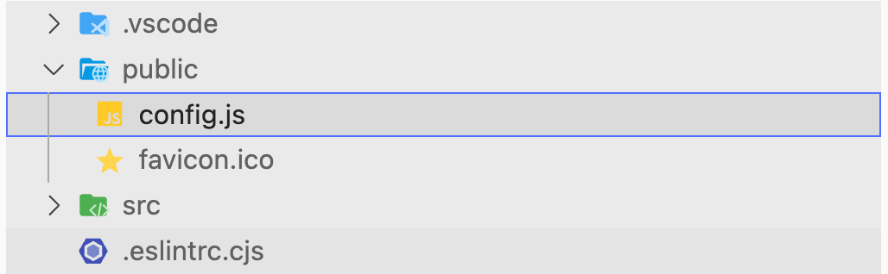

# 新建config.js
在项目public目录新建config.js文件



在config.js文件新建一个对象，放在window上

```javascript
window.CONFIG = {
  isDebug: false,
  intervalTime: 5 * 60 * 1000,
  baseURL: 'https://your-url.com',
}

```

# 引入config.js
在项目index.html中引入config.js

```html
<!DOCTYPE html>
<html lang="en" class="dark">
  <head>
    <meta charset="UTF-8">
    <link rel="icon" href="/favicon.ico">
    <meta name="viewport" content="width=device-width, initial-scale=1.0">
    <title>document</title>
  </head>
  <body>
    <div id="app"></div>
    <script type="module" src="/src/main.js"></script>
    <!-- 直接引入 -->
    <script type="" src="/config.js"></script>
  </body>
</html>

```

# 使用变量
在项目任何地方直接使用window.CONFIG.xxx，就可以使用定义的变量了

```javascript
setInterval(() => {
  doFilter()
}, window.CONFIG.intervalTime)
```

```javascript
import axios from 'axios'

const instance = axios.create({
  baseURL: window.CONFIG.baseURL,
  timeout: 15000
})

instance.interceptors.response.use((res) => {
  if (!res.data?.data) return {}
  return res.data
})

export default instance

```

# 动态修改config
这样新建的config.js，打包后还在dist根目录，直接修改config.js中的值就可以让打包后的项目使用修改后的变量

