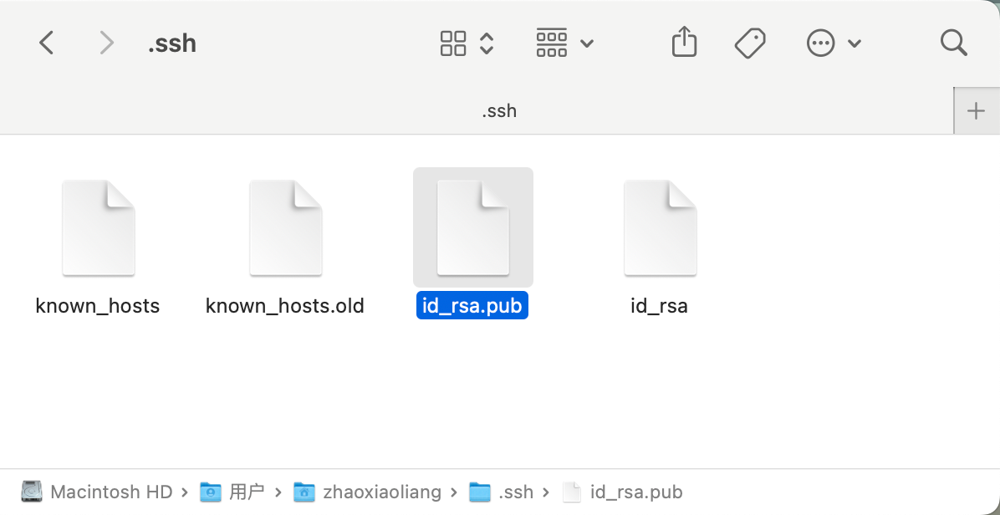
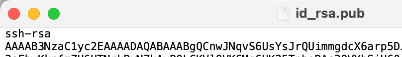
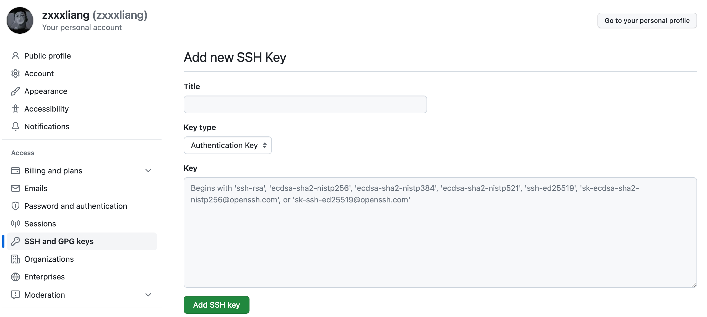

git使用过程中会遇到的一些常用的命令：

# 为本地环境配置公钥ssh
## 设置自己的用户名和邮箱
```bash
$ git config --global user.name "your_name"
$ git config --global user.email "your_email@example.com"
```

## 生成密钥
```bash
$ ssh-keygen -t rsa -b 4096 -C "your_email@example.com"[1]
```

在接下来直接回车就好了,如果已经存在会提醒你是否需要覆盖文件,输入y即可覆盖.

此时在电脑->用户目录中会出现一个.ssh文件

（访达->前往->前往文件夹->~/.ssh）



直接用记事本打开id_rsa.pub，它是一个以ssh-rsa开头，以你的邮箱结尾的一段文本



接下来在git的设置中添加ssh



点击 `Add SSH Key`按钮就添加成功了.

## 拥有了ssh之后即可从github上拉代码了，选择ssh的链接进行clone
```bash
$ git clone '你项目的链接'
```

此时文件夹中就有了你所clone的项目了

# 日常使用
## 拉取代码
```bash
$ git pull [origin 分支名]
```

git中的代码分为三个状态：工作区、暂存区、git仓库

## 提交代码
新写的代码是在工作区中存放，经过

```bash
$ git add .
```

之后，代码就从工作区转移到了暂存区，经过

```bash
$ git commit -m '提交描述'
```

之后，代码就从暂存区转移到了本地git仓库中。

把本地**代码提交**到远程git仓库

```bash
$ git push [origin 分支名]
```

远程代码中有撤销掉的代码时，需要使用

```bash
$ git push [origin 分支名] -f
```

强制提交代码(**慎用**)，这个操作会直接修改远程仓库的提交记录，如果错误使用就凉凉了。

在代码编写过程中随时可以

## **查看代码的提交状态**
```bash
$ git status
```

红色表示代码在工作区中，绿色表示代码在暂存区中，如果工作区和暂存区中都没有代码，将提示`nothing to commit, working tree clean`。

如果代码已经提交了，但是想要**撤销**会用到以下命令

## **撤销代码**
如果代码仅在工作区中修改,并没有`git add`过，那么理论上直接使用`ctrl + z`即可撤回，也可以使用

```bash
#放弃指定文件的修改
$ git checkout -- yourfilename.ext
#放弃所有文件的修改
$ git checkout .
```

如果代码已经`git add`过进入了暂存区，但是没有`git commit`过，那么可以使用

```bash
# 对单个文件
$ git reset HEAD yourfilename.ext  
$ git checkout -- yourfilename.ext
# 对所有
$ git reset HEAD 
$ git checkout .
```

如果代码已经`git commit`过进入了git仓库，那么需要先使用

```bash
$ git log
```

查看每一次的**提交记录**，找到要恢复到的版本的`commitID`，拿到`commitID`之后，使用

```bash
# 回滚整个版本
$ git reset --hard commitID
# 回滚某个指定文件
$ git reset --hard commitID '指定文件名'
```

代码进行一段时间的开发，需要建立不同的**分支**

## 查看分支
```bash
# 查看所有分支
$ git branch
# 新建分支
$ git branch '分支名'
# 切换分支
$ git checkout '分支名'
# 新建并切换分支
$ git checkout -b '分支名'
# 删除分支
$ git branch -d '分支名'
# 查看远程分支
$ git branch -a
# 新建一个指向指定commit的分支
$ git branch '分支名' 'commitID'
# 合并两个分支(将指定分支合并到当前分支)
$ git merge '分支名'
```

代码进行一段时间的开发，需要打tag

## 添加tag
```bash
# 列出所有tag
$ git tag
# 新建一个tag在当前commit
$ git tag [tag]
# 新建一个tag在指定commit
$ git tag [tag] [commit]
# 删除本地tag
$ git tag -d [tag]
# 删除远程tag
$ git push origin :refs/tags/[tagName]
# 查看tag信息
$ git show [tag]
# 提交指定tag
$ git push [remote] [tag]
# 提交所有tag
$ git push [remote] --tags
# 新建一个分支，指向某个tag
$ git checkout -b [branch] [tag]
```

## init仓库
如果是本地有项目代码，但是没有任何git操作，可以使用

```bash
$ git init
```

生成`.git`文件，来**进行版本控制**，使用

```bash
$ git remote add origin 'github上的空仓库'
$ git push -u origin master
```

将本地代码与远程仓库**建立连接**，使用

```bash
$ git remote set-url origin 'github上的仓库地址'
```

**更换关联**的远程仓库的地址。

## **<font style="color:#0e0e0e;">Cherry-pick（拣选）特定 commit 到当前分支</font>**
```shell
# 获取远程仓库的更新
git fetch

# 切换到目标分支
git checkout your-target-branch

# Cherry-pick 另一个分支上的特定 commit
git cherry-pick abc1234
```

